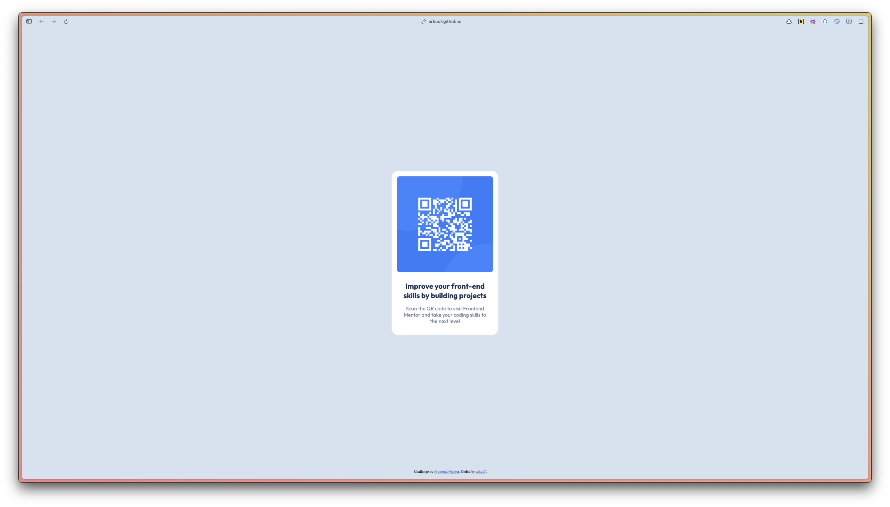

# Frontend Mentor - QR code component solution

This is a solution to the [QR code component challenge on Frontend Mentor](https://www.frontendmentor.io/challenges/qr-code-component-iux_sIO_H). Frontend Mentor challenges help you improve your coding skills by building realistic projects.

## Table of contents

- [Overview](#overview)
  - [Screenshot](#screenshot)
  - [Links](#links)
  - [Continued development](#continued-development)
  - [Useful resources](#useful-resources)
- [Author](#author)

## Overview

### Screenshot

### Links

- Solution URL: https://www.frontendmentor.io/solutions/qr-code-component-solution-GqzR6xniQH
- Live Site URL: https://arkus7.github.io/fm-qr-code-component/

### Continued development

I want to focus more on these topics before I go too deep into FE frameworks

- HTML structure
- More CSS/SCSS

### Useful resources

- [Reset margin and padding](https://css-tricks.com/reset-all-margins-padding/)
- [Letter spacing](https://developer.mozilla.org/en-US/docs/Web/CSS/letter-spacing)
- [Center vertically](https://www.w3schools.com/howto/howto_css_center-vertical.asp)
- [Fixed footer](https://www.w3schools.com/howto/howto_css_fixed_footer.asp)
- [Nested border radius](https://www.30secondsofcode.org/css/s/nested-border-radius/)
- [Measure distances between layers in Figma](https://help.figma.com/hc/en-us/articles/360039956974-Measure-distances-between-layers)

## Author

- Frontend Mentor - [@arkus7](https://www.frontendmentor.io/profile/arkus7)
